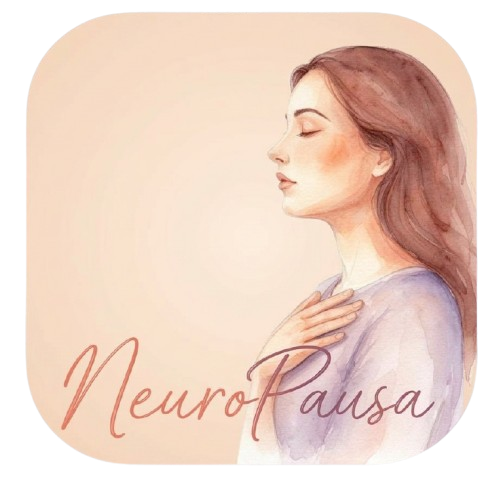
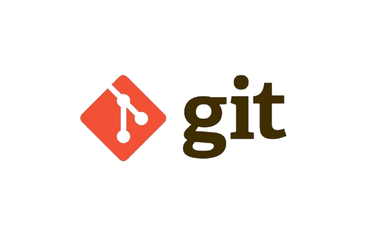

<p align="center">
  
</p>
# NeuroPausa

## Descripción del Proyecto
NeuroPausa es una solución digital enfocada en el bienestar integral de mujeres durante la menopausia. La plataforma ofrece información confiable, recursos especializados y herramientas de acompañamiento para mejorar la calidad de vida de sus usuarias.

Nuestra startup se enfoca en el desarrollo y lanzamiento de NeuroPausa, una aplicación móvil diseñada como soporte cognitivo-emocional para mujeres en etapa de menopausia.

La iniciativa nace con el propósito de ofrecer una solución digital de salud integral, centrada en el seguimiento diario de síntomas menopáusicos como:

- Estado de ánimo  
- Calidad del sueño  
- Concentración  
- Estrés  
- Fatiga mental  

A través del uso de inteligencia artificial, ejercicios de estimulación cognitiva basados en neuropsicología y un módulo de psicoeducación, buscamos fortalecer a las usuarias y facilitar el trabajo de los profesionales de la salud mediante un panel de control avanzado con historial exportable.

---

## Autores

- Jose Luis Arbañil Garrido — U20221G367  
- Farid Elmer Camacho Albujar — U20241G288  
- Gonzalo Sebastian Reategui Tello — U202423599  
- Choquehuanca Vasquez Alejandro Samir — U202420249  
- Hugo Alfredo Vega Vargas — U202416973  

---

## Segmento Objetivo

### Mujeres entre 45-60 años
Este segmento comprende a mujeres entre 45 y 60 años que experimentan la transición menopáusica, principalmente en zonas urbanas.

Son usuarias clave porque buscan mantener su calidad de vida y autonomía frente a síntomas como:

- Lagunas mentales  
- Estrés  
- Cambios de humor  
- Fatiga emocional  

Su principal necesidad no es únicamente recibir información teórica, sino contar con herramientas privadas y accesibles que les permitan recuperar el control de su bienestar diario.

---

### Médicos ginecólogos y psicólogos
Este segmento comprende a:

- Ginecólogos  
- Endocrinólogos  
- Psicólogos clínicos  
- Terapeutas  

Estos profesionales acompañan a mujeres durante la etapa de climaterio.

Su principal necesidad es contar con información estructurada y reportes visuales confiables que permitan:

- Optimizar consultas  
- Mejorar diagnósticos  
- Brindar atención personalizada  

---

## Principales Características

NeuroPausa ofrece:

- Seguimiento diario de síntomas  
- Registro de estado emocional  
- Monitoreo del sueño  
- Ejercicios de estimulación cognitiva  
- Artículos de psicoeducación  
- Panel de control para profesionales  
- Reportes exportables  
- Interfaz accesible y amigable  

---

## Tecnologías Utilizadas
- HTML5 
<p align="center">
  
</p>
- CSS3  
<p align="center">
  
</p>
- JavaScript  
<p align="center">
  
</p>
- Git  
<p align="center">
  
</p>
- GitHub 
<p align="center">
  
</p>  
---

## Estructura del Proyecto

```plaintext
public/
 ├── assets/
 │   ├── images/
 │   ├── scripts/
 │   └── styles/
 ├── favicon.ico
 ├── index.html
 ├── funciones.html
 ├── proposito.html
 └── recursos.html
```
## Flujo de Trabajo Git

El proyecto utiliza GitFlow para la gestión de versiones y trabajo colaborativo:

main → rama principal del proyecto
develop → rama de integración
feature/responsive-fixes → ramas para nuevas funcionalidades
gh-pages → rama de despliegue para GitHub Pages